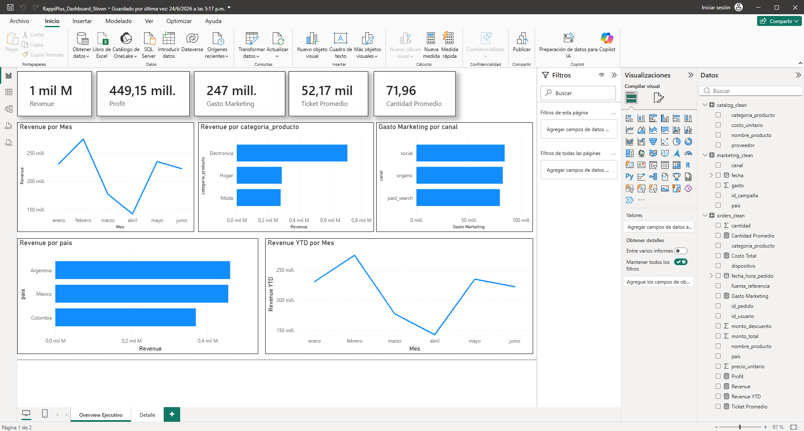
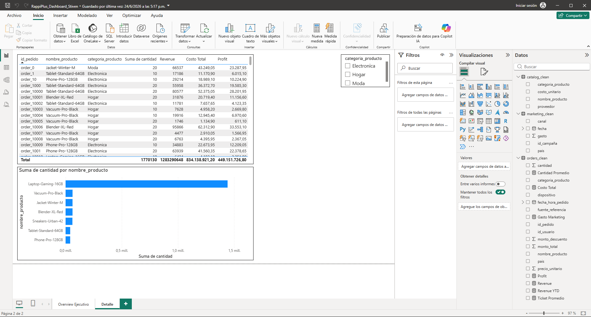

# Análisis de Negocios de RappiPlus

Análisis de rentabilidad, funnel de conversión, retención por cohortes y test A/B para el servicio RappiPlus, con dashboard en Power BI.

## Resumen del proyecto
Evalué el desempeño del servicio RappiPlus para apoyar decisiones de negocio basadas en datos, usando Python, SQL y Power BI sobre datasets de pedidos, catálogo y marketing.

## Hallazgos clave
- **Rentabilidad:** Revenue de $51.8M, costo de $43M y $2.7M en marketing → margen de ganancia de ~12%.
- **Funnel de conversión:** De 7,796 usuarios en la primera visita a 6,240 compras. La mayor fuga ocurre entre "checkout" y "pago" (~12 pp de caída).
- **Retención por cohortes:** ~42% de los usuarios siguen activos en la semana 1, de forma consistente en los 4 meses analizados.
- **Test A/B:** Se probó un cambio de UI en el checkout (control 15.69% vs tratamiento 16.29% de conversión). Con un test chi-cuadrado (p=0.43), el cambio no mostró impacto estadísticamente significativo.

## Dashboard en Power BI

## Herramientas utilizadas
Python (Pandas), SQL, Power BI, análisis estadístico (chi-cuadrado)

## Archivos
- `S12 Estudiante_Proyecto_Final (2).ipynb` — notebook completo del análisis
- `Panel de control de RappiPlus_Stiven.pbix` — archivo de Power BI
